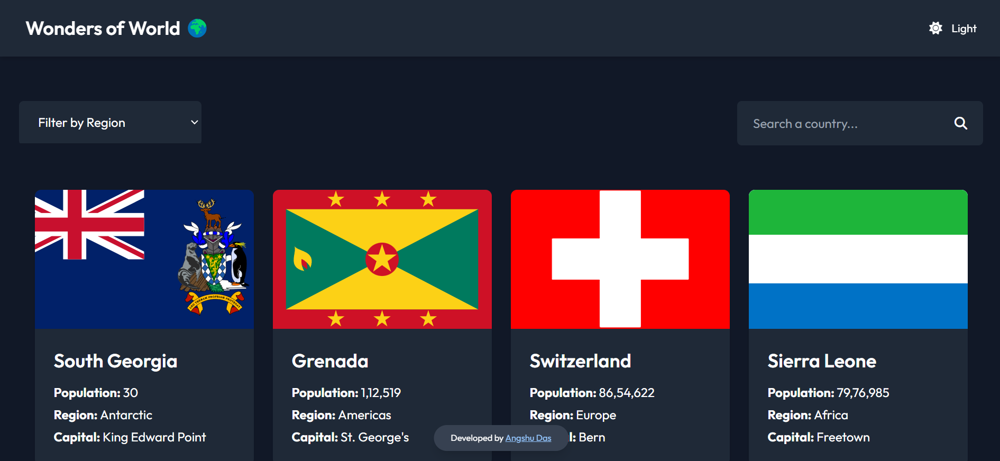
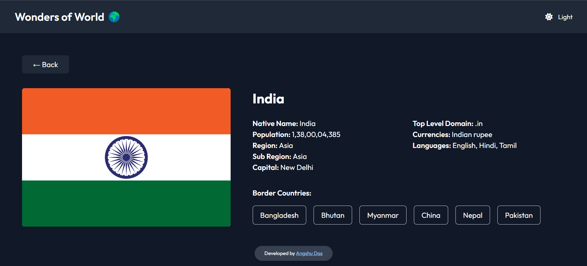

# Wonders Of World

Wonders Of World is a React project designed to make exploring and learning about countries seamless and engaging. This application integrates modern UI design, dynamic data fetching, and user-friendly features to deliver an exceptional experience.

## 🌐 Live Project

Check out the live project 👉 [Wonders Of World](https://wonders-of-the-world-project.netlify.app/)

## 🚀 Features

### Core Features

1. **Dynamic Country Cards**:
   - Fetches country data from a REST API and displays it in clean, organized card formats.

2. **Detailed Country Pages**:
   - Displays borders of the selected country.
   - Shows detailed information, including population, top-level domains, languages, and more.

3. **Search and Filter Options**:
   - Quick search functionality to find countries easily.
   - Region-based filtering for streamlined navigation.

### User Experience Enhancements

1. **Dark and Light Modes**:
   - A theme toggle allows users to switch between dark and light modes.
   - Preferences are stored in local storage to maintain user settings across sessions.

2. **Responsive and Modern UI**:
   - Designed with Tailwind CSS for a sleek, modern, and responsive interface.
   - Ensures compatibility and usability across all devices.

## 🛠️ Technologies Used

- **React.js**: For building the frontend components.
- **Tailwind CSS**: For styling and layout.
- **REST API**: For dynamic data fetching.
- **Netlify**: For deployment.

## 💡 Skills Enhanced

1. **React Component Design and State Management**: Modular and reusable component structures.
2. **API Integration and Data Handling**: Fetching and managing external data seamlessly.
3. **Tailwind CSS**: Crafting modern and responsive designs.
4. **Deployment and Routing Management**: Implementing SPA routing and deployment strategies.

## 📂 Project Structure

```
Wonders_Of_World/
├── node_modules/          # Installed dependencies
├── public/                # Static assets
├── src/
│   ├── Components/        # React components
│   │   ├── CountriesContainer.jsx
│   │   ├── CountriesContainerShimmer.jsx
│   │   ├── CountryCard.jsx
│   │   ├── CountryDetails.jsx
│   │   ├── CountryDetailsShimmer.jsx
│   │   ├── ErrorPage.jsx
│   │   ├── Footer.jsx
│   │   ├── Header.jsx
│   │   ├── Home.jsx
│   │   ├── Search.jsx
│   │   └── SearchMenu.jsx
│   ├── App.jsx            # Main application file
│   ├── main.jsx           # Entry point
│   ├── index.css          # Global styles
│   └── notFound.png       # 404 image
├── .gitignore             # Git ignored files
├── eslint.config.js       # ESLint configuration
├── index.html             # HTML template
├── package-lock.json      # Dependency lock file
├── package.json           # Project metadata and dependencies
├── postcss.config.js      # PostCSS configuration
├── tailwind.config.js     # Tailwind CSS configuration
├── vite.config.js         # Vite configuration
└── README.md              # Project documentation
```

## ⚙️ Installation and Setup

1. **Clone the Repository**
   ```bash
   git clone https://github.com/Angshu09/Wonders_Of_World.git
   ```

2. **Navigate to the Project Directory**
   ```bash
   cd Wonders_Of_World
   ```

3. **Install Dependencies**
   ```bash
   npm install
   ```

4. **Start the Development Server**
   ```bash
   npm run dev
   ```

5. Open your browser and navigate to `http://localhost:5173/` to explore Wonders Of World.
 
## 📸 Screenshots

### Home Page


### Country Details Page


---

Developed with ❤️ by **Angshu Das**.
